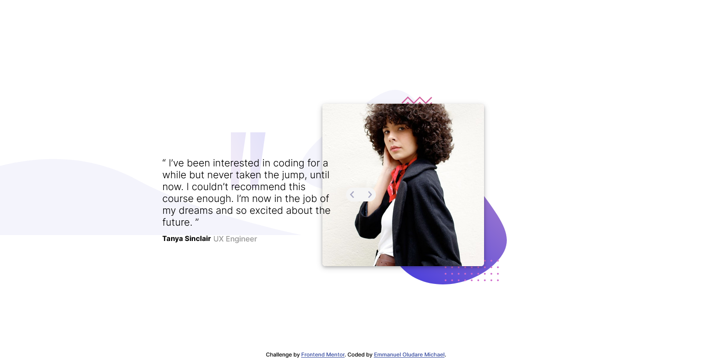

# Frontend Mentor - Coding bootcamp testimonials slider solution

This is a solution to the [Coding bootcamp testimonials slider challenge on Frontend Mentor](https://www.frontendmentor.io/challenges/coding-bootcamp-testimonials-slider-4FNyLA8JL). Frontend Mentor challenges help you improve your coding skills by building realistic projects. 

## Table of contents

- [Overview](#overview)
  - [The challenge](#the-challenge)
  - [Screenshot](#screenshot)
  - [Links](#links)
- [My process](#my-process)
  - [Built with](#built-with)
  - [What I learned](#what-i-learned)
  - [Continued development](#continued-development)
  - [Useful resources](#useful-resources)
- [Author](#author)
- [Acknowledgments](#acknowledgments)

## Overview

### The challenge

Users should be able to:

- View the optimal layout for the component depending on their device's screen size
- Navigate the slider using either their mouse/trackpad or keyboard

### Screenshot




### Links

- Solution URL: [Add solution URL here](https://your-solution-url.com)
- Live Site URL: [Add live site URL here](https://your-live-site-url.com)

## My process
I Planned the structuring then when on to try out the possibility of me solving the slider technique with Javascript, I encountered a few problems but i overcame them.I then started coding,I adopted this approach because Html and css seemed to be less tedious.

### Built with

- Semantic HTML5 markup
- CSS custom properties
- Flexbox
- Mobile-first workflow
- Vanilla Javascript

### What I learned

I learnt more about keyboard events and also experimented on it,I think its a really cool way to improve user experience.This is also my my first projct using css variables and i really enjoyed it.

```css
:root{
    --DarkBlue:hsl(240, 38%, 20%);
    --GrayishBlue:hsl(240, 18%, 77%);
}
```
```js
document.addEventListener('keydown', e => {
	if (e.keyCode === 37) {
		if (current === 0) {
			current=sliderImages.length;	
	    }
		slideLeft();	
	}
})
```

### Continued development
I personally think that css variables are really cool and i will continue to use them.

### Useful resources

- [Youtube](https://www.youtube.com/watch?v=7ZO2RTMNSAY) - This helped me for the slider technique. I really liked this pattern and will use it going forward.

## Author

- Frontend Mentor - [@Michaelhybrid](https://www.frontendmentor.io/profile/Michaelhybrid)
- Twitter - [@micheal_olu99](https://twitter.com/micheal_olu99)

## Acknowledgments

To God be the glory for helping me complete this task.
Thanks to Traversy Media.


